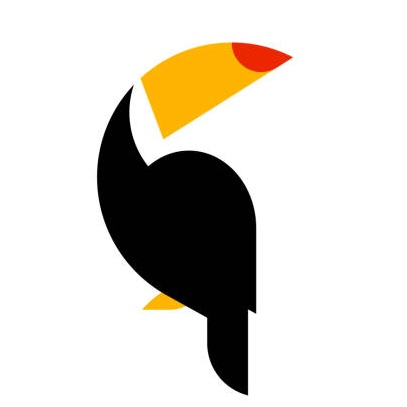
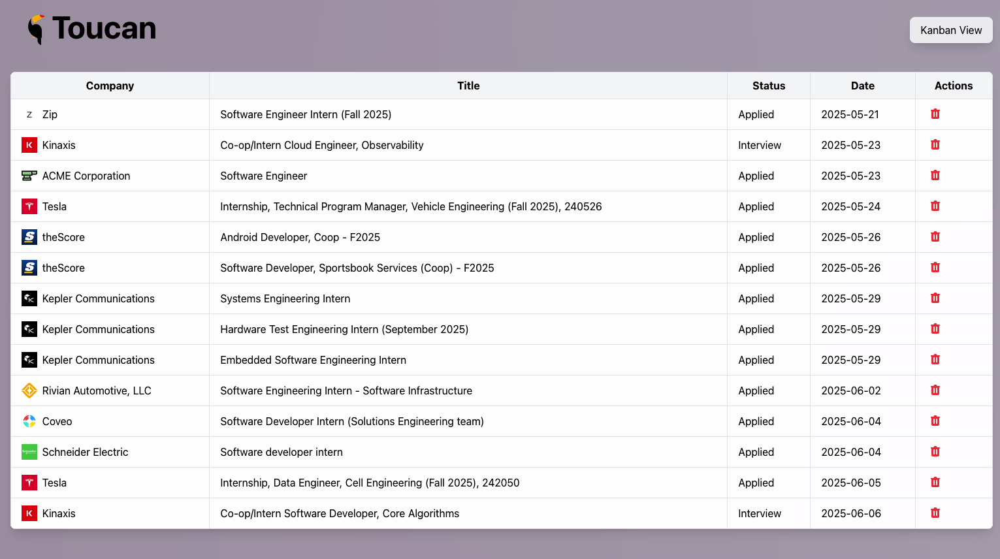
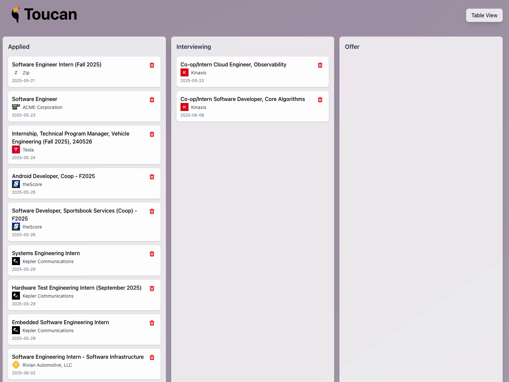

<h1> Toucan Job Tracker</h1>


> As if applying for jobs wasn't already driving me crazy, tracking them was even worse.
<div>
 

</div>

A modern job tracking app to help you organize your job search, built with React (frontend) and Go (backend).

---

## 🚀 Features
- Kanban and table views for job applications
- Company logo integration via Logo.dev
- Gmail IMAP integration for fetching job-related emails
- Delete and manage job postings
- Modern, responsive UI

---

## 🛠️ Setup Instructions

### 1. Clone the repository
```bash
git clone <your-repo-url>
cd JOBTRACKING
```

### 2. Backend Setup (Go)
- Install Go (https://golang.org/dl/)
- Set up your `.env` file with your Gmail IMAP credentials and API keys:

```
GMAIL_USER=your.email@gmail.com
GMAIL_PASS=your_gmail_app_password
OPENAI_API_KEY=your_openai_api_key
LOGO_DEV=your_logo_dev_api_key
```

- Start the backend server:
```bash
go run .
```

### 3. Frontend Setup (React + Vite)
- Go to the frontend directory:
```bash
cd frontend
```
- Install dependencies:
```bash
npm install
```
- Create a `.env` file in the `frontend` directory:
```
VITE_LOGO_DEV_KEY=your_logo_dev_api_key
```
- Start the frontend:
```bash
npm run dev
```

---

## 🔑 Key Learnings

**1. IMAP Process Management**
- When fetching from IMAP, the connection is responsible for its own process. Manually closing it can cause the pipe to crash. Let the library manage the connection lifecycle for best practices.

**2. CORS and API Integration**
- The OpenAPI backend responds in a format that wasn't friendly to the React frontend. Fixed this by adding CORS middleware to the Go backend, allowing the frontend to communicate smoothly.

---

## 📝 Next Steps
- Enhance specific application tracking features
- Add user authentication
- Deploy the app for public use

---

## 🙏 Credits
- [Logo.dev](https://logo.dev) for company logos
- [React](https://react.dev/) & [Vite](https://vitejs.dev/)
- [Go](https://golang.org/)

---

Feel free to fork, contribute, or reach out if you have questions! 
